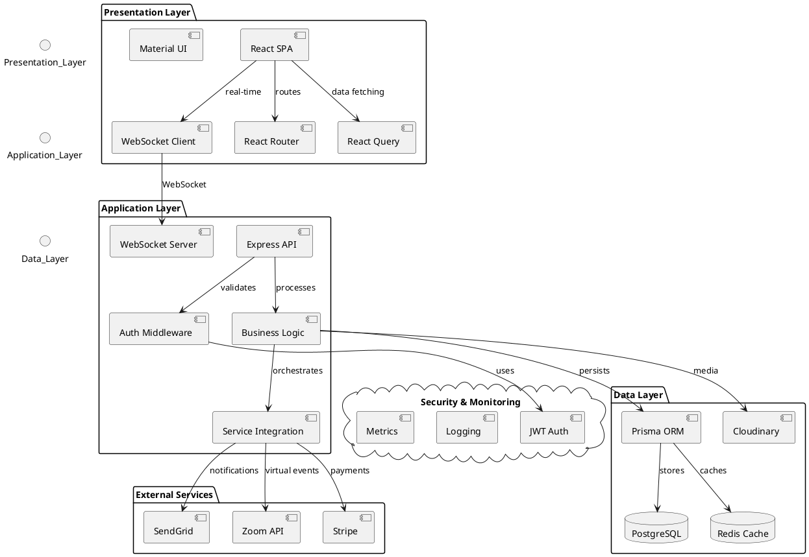
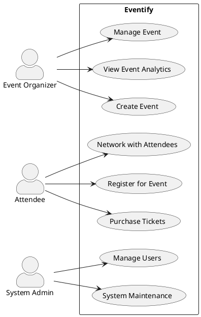
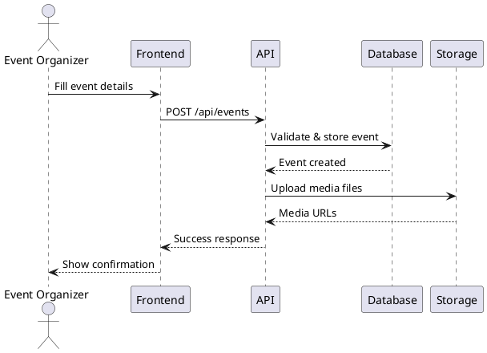
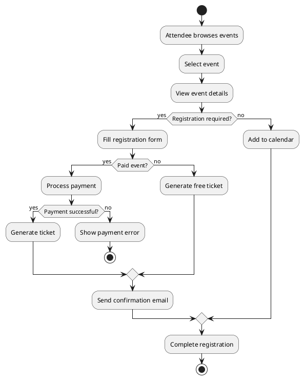
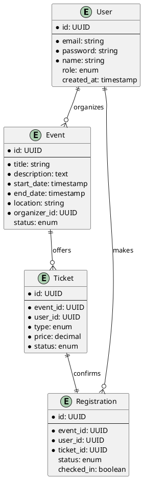
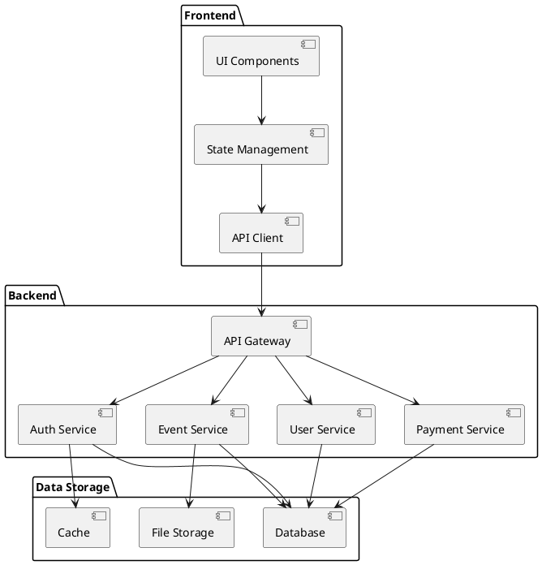

# Chapter 3: System Analysis and Design

## 3.1 Introduction

This chapter outlines the system analysis and design phase of the Eventify project. It details the approach taken to translate the project requirements into a concrete system design, including the functional and non-functional requirements, system architecture, and various modeling diagrams that illustrate the system's structure and behavior.

## 3.2 Research Design

The research design for Eventify follows a mixed-method approach, combining elements of both qualitative and quantitative research:

1. Literature Review: A comprehensive review of existing event management systems and relevant technologies was conducted to inform the design decisions.

2. User Surveys: Quantitative data was collected through surveys of potential users (event organizers and attendees) to gather specific requirements and preferences.

3. Expert Interviews: Qualitative data was obtained through semi-structured interviews with experienced event managers to gain insights into industry needs and challenges.

4. Prototyping: An iterative prototyping approach was used to refine the user interface and system features based on user feedback.

5. System Modeling: Various UML diagrams were created to model the system's structure and behavior, facilitating a clear understanding of the system design.

## 3.3 Functional and Non-Functional Requirements

### 3.3.1 Functional Requirements

1. **User Management**

   - The system shall authenticate users through email and password.
   - The system shall store user profiles with name, email, and contact information.
   - The system shall assign user roles of Organizer, Attendee, or Sponsor.
   - The system shall restrict access to features based on assigned user roles.

2. **Event Management**

   - The system shall store event details including title, date, time, location, and description.
   - The system shall validate event dates against the calendar system.
   - The system shall categorize events by predefined types.
   - The system shall support media attachments up to 10MB per event.

3. **Ticketing Management**

   - The system shall generate unique ticket identifiers.
   - The system shall limit ticket sales to available capacity.
   - The system shall process ticket payments through the payment gateway.
   - The system shall deliver tickets electronically to purchasers.

4. **Event Discovery**

   - The system shall display events in chronological order.
   - The system shall filter events by category.
   - The system shall filter events by date range.
   - The system shall return search results within 3 seconds.

5. **Communication**

   - The system shall send confirmation emails for registrations.
   - The system shall send reminder emails 24 hours before events.
   - The system shall notify organizers of new registrations.
   - The system shall maintain message logs for 30 days.

6. **Analytics**

   - The system shall track ticket sales quantities.
   - The system shall calculate daily revenue totals.
   - The system shall record event attendance numbers.
   - The system shall generate attendance reports in CSV format.

7. **Attendee Engagement**

   - The system shall deliver messages between attendees in real-time.
   - The system shall display attendee profiles with professional information.
   - The system shall record connection requests between attendees.
   - The system shall maintain an attendee directory for each event.

8. **Virtual Event Support**

   - The system shall authenticate virtual event access through single-use tokens.
   - The system shall transmit event joining links to registered attendees via email.
   - The system shall record virtual event attendance status.
   - The system shall maintain virtual event schedules in UTC timezone.
   - The system shall validate virtual event capacity against registration limits.

### 3.3.2 Non-Functional Requirements

1. **Performance**

   - The system shall process user requests within 3 seconds.
   - The system shall support 100 concurrent users.
   - The system shall maintain 99% uptime.
   - The system shall complete database queries within 1 second.

2. **Security**

   - The system shall encrypt all user passwords.
   - The system shall enforce HTTPS for all connections.
   - The system shall timeout inactive sessions after 30 minutes.
   - The system shall log all authentication attempts.

3. **Usability**

   - The system shall display error messages in plain English.
   - The system shall provide keyboard navigation.
   - The system shall conform to WCAG 2.1 Level AA standards.
   - The system shall support screen readers.

4. **Reliability**

   - The system shall backup data daily.
   - The system shall restore from backup within 4 hours.
   - The system shall handle input validation errors gracefully.
   - The system shall maintain data integrity during concurrent operations.

5. **Compatibility**

   - The system shall support Chrome version 90 and above.
   - The system shall support Firefox version 88 and above.
   - The system shall support Safari version 14 and above.
   - The system shall support Edge version 90 and above.

6. **Maintainability**

   - The system shall log all errors with timestamps.
   - The system shall provide API documentation.
   - The system shall implement database migrations.
   - The system shall follow REST architectural principles.

## 3.4 Proposed Model

## 3.5 System Architecture

The Eventify system employs a modern three-tier architecture designed to provide scalability, maintainability, and separation of concerns. Each layer serves specific functions while maintaining loose coupling for flexibility and easy updates.

### 1. Presentation Layer (Client Tier)

- **Core Components**:

  - React.js SPA providing component-based UI architecture
  - React Router handling client-side navigation and route protection
  - React Query managing server state and caching
  - Material-UI and Tailwind CSS for responsive, accessible interface

- **Key Functions**:

  - User interface rendering and state management
  - Client-side form validation and data formatting
  - Local storage management for user preferences
  - Real-time updates via WebSocket connections
  - Client-side caching for improved performance

### 2. Application Layer (Business Logic Tier)

- **Core Components**:

  - Express.js REST API handling HTTP requests
  - Authentication middleware using JWT
  - Business logic controllers for each domain
  - WebSocket server for real-time features
  - Service integrations (Stripe, SendGrid, Zoom)

- **Key Functions**:

  - Request validation and sanitization
  - Business rule enforcement
  - Session management and security
  - External service orchestration
  - Data transformation and aggregation
  - Event processing and queuing

### 3. Data Layer (Persistence Tier)

- **Core Components**:

  - PostgreSQL database for relational data
  - Prisma ORM for type-safe database operations
  - Cloudinary for media storage
  - Redis for caching and session storage

- **Key Functions**:

  - ACID-compliant data storage
  - Data backup and recovery
  - Query optimization
  - Cache management
  - Media file handling

### Information Flow

1. **User Interactions**:

   - Client initiates requests through UI actions
   - React components dispatch API calls
   - WebSocket connections maintain real-time state

2. **Request Processing**:

   - API Gateway validates requests and authentication
   - Controllers route requests to appropriate services
   - Business logic applies domain rules
   - External services are called as needed

3. **Data Operations**:
   - Prisma ORM handles database transactions
   - Cache layer checks/updates Redis
   - File operations route through Cloudinary
   - Results propagate back through the layers

### Cross-Cutting Concerns

- **Security**: JWT authentication, HTTPS, CORS policies
- **Logging**: Winston for application logs across layers
- **Monitoring**: Performance metrics and error tracking
- **Caching**: Multi-level caching strategy
- **Error Handling**: Consistent error responses and recovery

### Architecture Diagram



This architecture enables Eventify to handle complex event management workflows while maintaining performance, scalability, and reliability. The separation of concerns allows for independent scaling of components and easier maintenance of the codebase.

## 3.6 Development Diagrams

### 3.6.1 Use Case Diagram

The following use case diagram illustrates the main interactions between different actors (Event Organizers, Attendees, and System Administrators) and the Eventify system. It shows the key functionality available to each user type.



### 3.6.2 Event Creation Sequence Diagram

This sequence diagram demonstrates the flow of creating a new event in the system, showing interactions between the Event Organizer, Frontend UI, API, Database, and Storage components. It highlights the validation, storage, and media handling steps.



### 3.6.3 Event Registration Activity Diagram

The activity diagram below maps out the complete event registration process, including both free and paid registration paths. It shows decision points, payment processing, and confirmation steps that an attendee goes through.



### 3.6.4 Entity-Relationship Diagram (ERD)

This ERD shows the core data structure of Eventify, illustrating relationships between Users, Events, Tickets, and Registrations. It includes primary keys, essential attributes, and relationship cardinalities.



### 3.6.5 System Component Diagram

The component diagram outlines the high-level architecture of Eventify, showing the major components in the Frontend, Backend, and Data Storage layers and their interactions through defined interfaces.



### 3.6.6 Package Diagram

This package diagram demonstrates the logical organization of the codebase, showing how different modules are grouped and their dependencies, both in the frontend and backend portions of the system.

```plantuml
@startuml Package Diagram
package "Frontend" {
  package "Components" {
    [Pages]
    [Shared]
    [Forms]
  }
  package "Services" {
    [API]
    [Auth]
    [Storage]
  }
  package "Utils" {
    [Helpers]
    [Validators]
  }
}

package "Backend" {
  package "API" {
    [Routes]
    [Controllers]
    [Middleware]
  }
  package "Core" {
    [Services]
    [Models]
    [Config]
  }
  package "Infrastructure" {
    [Database]
    [External]
    [Security]
  }
}

[Components] --> [Services]
[Services] --> [Utils]
[API] --> [Core]
[Core] --> [Infrastructure]

@enduml
```

## 3.7 Development Tools

The following tools and technologies will be used in the development of Eventify:

1. Frontend Development

   - **React.js**: Core UI framework
   - **Vite**: Fast, modern build tool and dev server
   - **React Router**: Client-side routing
   - **React Query**: Data fetching and caching
   - **React Hook Form**: Form handling with validation
   - **Tailwind CSS**: Utility-first CSS framework
   - **Material-UI**: Component library
   - **Chart.js**: Basic analytics visualization
   - **QRCode.js**: QR code generation

2. Backend Development

   - **Node.js/Express.js**: Server framework
   - **Prisma**: Type-safe ORM
   - **JWT**: Authentication
   - **Bcrypt**: Password hashing
   - **Multer**: Local file uploads
   - **Winston**: Basic logging
   - **Socket.io**: Basic real-time features

3. External Services

   - **Cloudinary**: Media storage
   - **Stripe**: Secure payment processing integration
   - **SendGrid**: Reliable email delivery service
   - **Zoom API**: Virtual events
   - **Netlify**: Frontend hosting
   - **Railway**: Backend hosting

4. Development Environment

   - **VS Code**: Primary IDE
   - **Git**: Version control
   - **npm**: Package management
   - **Postman**: API testing

5. Testing and Quality

   - **Jest**: Testing framework
   - **React Testing Library**: Component testing
   - **Supertest**: API testing
   - **ESLint/Prettier**: Code formatting

This set of tools and technologies will enable efficient development and deployment of the Eventify system as an MVP (Minimum Viable Product), providing a live, accessible version for demonstration and testing.
