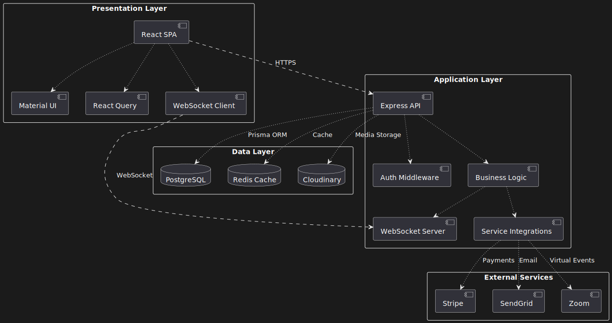
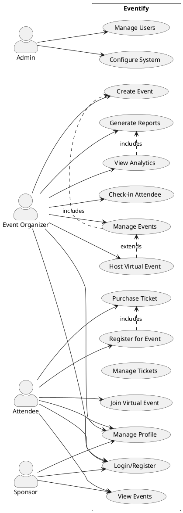
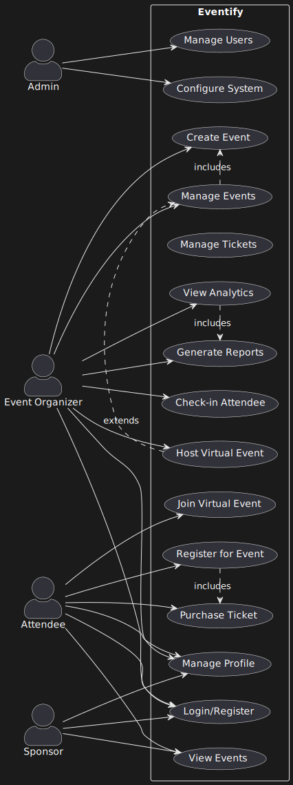
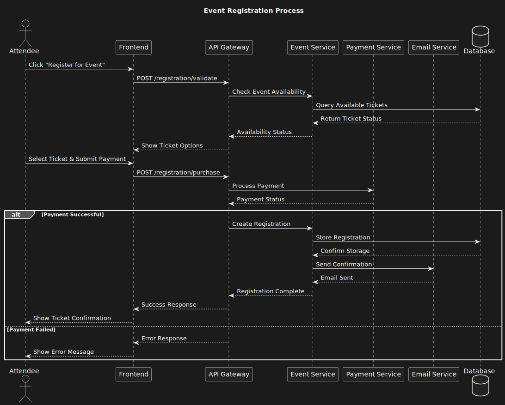
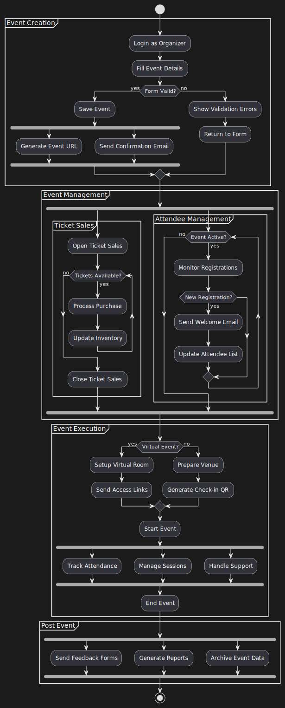
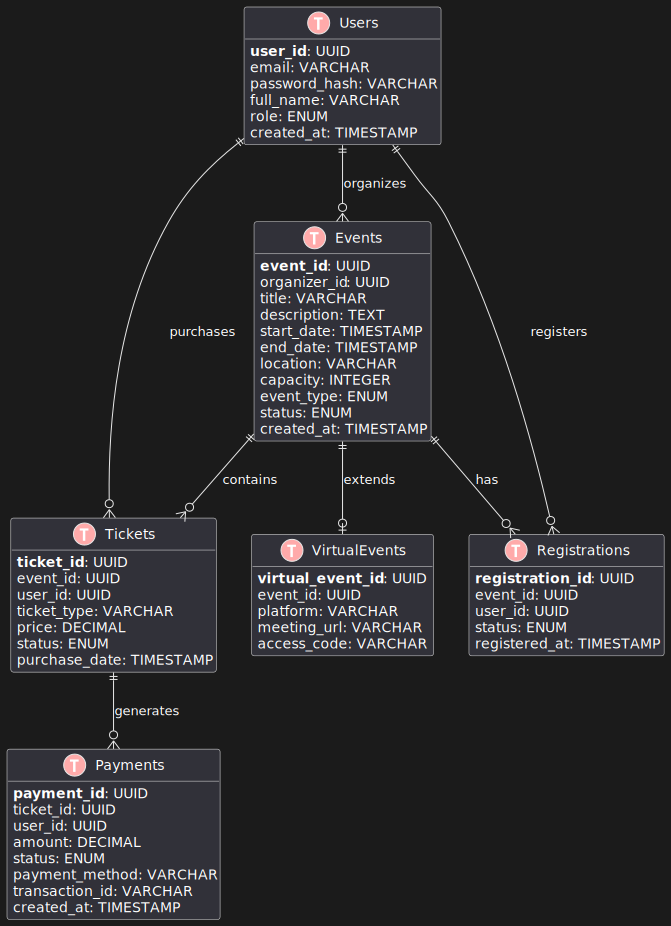
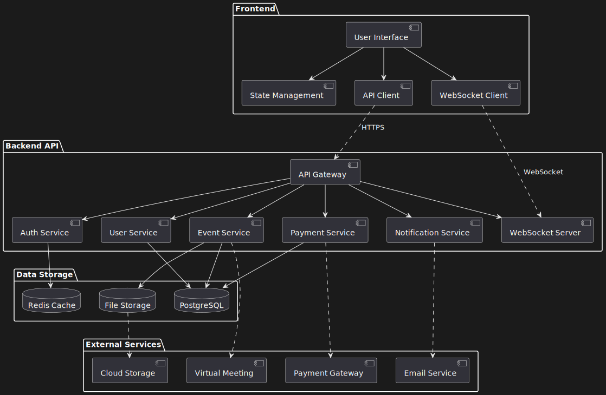
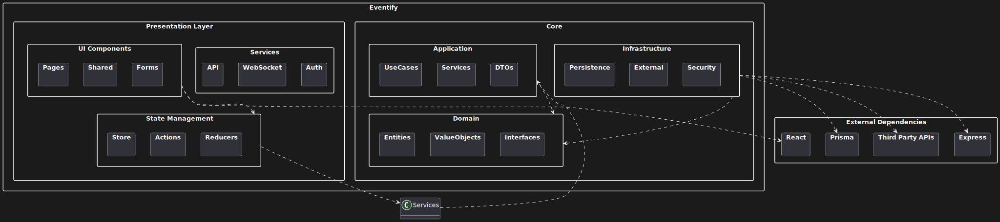

# Chapter 3: System Analysis and Design

## 3.1 Introduction

This chapter outlines the system analysis and design phase of the Eventify project. It details the approach taken to translate the project requirements into a concrete system design, including the functional and non-functional requirements, system architecture, and various modeling diagrams that illustrate the system's structure and behavior.

## 3.2 Research Design

The research design for Eventify follows a mixed-method approach, combining elements of both qualitative and quantitative research:

1. **Literature Review**: A comprehensive review of existing event management systems and relevant technologies will be conducted to inform the design decisions.

2. **User Surveys**: Quantitative data will be collected through surveys of potential users (event organizers and attendees) to gather specific requirements and preferences.

3. **Expert Interviews**: Qualitative data will be obtained through semi-structured interviews with experienced event managers to gain insights into industry needs and challenges.

4. **Prototyping**: An iterative prototyping approach will be used to refine the user interface and system features based on user feedback.

5. **System Modeling**: Various UML diagrams were created to model the system's structure and behavior, facilitating a clear understanding of the system design.

## 3.3 Functional and Non-Functional Requirements

### 3.3.1 Functional Requirements

1. **User Management**

   - The system shall authenticate users through email and password.
   - The system shall store user profiles with name, email, and contact information.
   - The system shall assign user roles of Organizer, Attendee, or Sponsor.
   - The system shall restrict access to features based on assigned user roles.

2. **Event Management**

   - The system shall store event details including title, date, time, location, and description.
   - The system shall validate event dates against the calendar system.
   - The system shall categorize events by predefined types.
   - The system shall support media attachments up to 10MB per event.

3. **Ticketing Management**

   - The system shall generate unique ticket identifiers.
   - The system shall limit ticket sales to available capacity.
   - The system shall process ticket payments through the payment gateway.
   - The system shall deliver tickets electronically to purchasers.

4. **Event Discovery**

   - The system shall display events in chronological order.
   - The system shall filter events by category.
   - The system shall filter events by date range.
   - The system shall return search results within 3 seconds.

5. **Communication**

   - The system shall send confirmation emails for registrations.
   - The system shall send reminder emails 24 hours before events.
   - The system shall notify organizers of new registrations.
   - The system shall maintain message logs for 30 days.

6. **Analytics**

   - The system shall track ticket sales quantities.
   - The system shall calculate daily revenue totals.
   - The system shall record event attendance numbers.
   - The system shall generate attendance reports in CSV format.

7. **Attendee Engagement**

   - The system shall deliver messages between attendees in real-time.
   - The system shall display attendee profiles with professional information.
   - The system shall record connection requests between attendees.
   - The system shall maintain an attendee directory for each event.

8. **Virtual Event Support**

   - The system shall authenticate virtual event access through single-use tokens.
   - The system shall transmit event joining links to registered attendees via email.
   - The system shall record virtual event attendance status.
   - The system shall maintain virtual event schedules in UTC timezone.
   - The system shall validate virtual event capacity against registration limits.

### 3.3.2 Non-Functional Requirements

1. **Performance**

   - The system shall process user requests within 3 seconds.
   - The system shall support 100 concurrent users.
   - The system shall maintain 99% uptime.
   - The system shall complete database queries within 1 second.

2. **Security**

   - The system shall encrypt all user passwords.
   - The system shall enforce HTTPS for all connections.
   - The system shall timeout inactive sessions after 30 minutes.
   - The system shall log all authentication attempts.

3. **Usability**

   - The system shall display error messages in plain English.
   - The system shall provide keyboard navigation.
   - The system shall conform to WCAG 2.1 Level AA standards.
   - The system shall support screen readers.

4. **Reliability**

   - The system shall backup data daily.
   - The system shall restore from backup within 4 hours.
   - The system shall handle input validation errors gracefully.
   - The system shall maintain data integrity during concurrent operations.

5. **Compatibility**

   - The system shall support Chrome version 90 and above.
   - The system shall support Firefox version 88 and above.
   - The system shall support Safari version 14 and above.
   - The system shall support Edge version 90 and above.

6. **Maintainability**

   - The system shall log all errors with timestamps.
   - The system shall provide API documentation.
   - The system shall implement database migrations.
   - The system shall follow REST architectural principles.

## 3.4 Development Model

For the development of Eventify, we adopted an Agile development methodology, specifically using Scrum, due to its alignment with our project requirements and constraints:

### 3.4.1 Understanding Agile and Scrum

Agile is an iterative approach to software development that emphasizes flexibility, continuous improvement, and rapid delivery. The methodology focuses on breaking projects into small, manageable chunks called iterations or sprints. Scrum, a popular Agile framework, provides a specific structure for implementing Agile principles through defined roles (Scrum Master, Product Owner, Development Team), ceremonies (Sprint Planning, Daily Standups, Sprint Review, Retrospectives), and artifacts (Product Backlog, Sprint Backlog, Increment).

Key principles of Agile include:

- Customer collaboration over contract negotiation
- Responding to change over following a plan
- Working software over comprehensive documentation
- Individuals and interactions over processes and tools

Scrum enhances these principles by providing:

- Fixed-length iterations (sprints) typically 2-4 weeks long
- Clear roles and responsibilities
- Regular inspection and adaptation
- Empirical process control

### 3.4.2 Why Agile for Eventify

1. **Iterative Development**

   - Enables gradual rollout of features, starting with core event management
   - Allows early testing of critical components like payment processing and ticket generation
   - Facilitates rapid adaptation to user feedback, especially for UI/UX improvements

2. **Sprint-Based Delivery**

   - 2-week sprints align with our 4-month development timeline
   - Sprint 1-2: Core user and event management
   - Sprint 3-4: Ticketing and payment systems
   - Sprint 5-6: Virtual event integration
   - Sprint 7-8: Analytics and reporting features

3. **Risk Management**
   - Early identification of technical challenges in payment gateway integration
   - Continuous security testing throughout development
   - Regular stakeholder reviews to ensure alignment with requirements

### 3.4.3 Agile Practices in Eventify

1. **Daily Standups**

   - Track progress on feature development
   - Identify blocking issues, especially for dependent components
   - Ensure coordination between frontend and backend teams

2. **Sprint Planning**

   - Prioritize features based on user value
   - Estimate story points for complex features like real-time notifications
   - Plan integration points between system components

3. **Continuous Integration/Deployment**
   - Automated testing for each component
   - Regular deployments to staging environment
   - Feature flags for gradual rollout

### 3.4.4 Adaptation to Project Needs

1. **Modified Reviews**

   - Weekly stakeholder demos instead of end-of-sprint only
   - Combined code reviews with security audits
   - User testing sessions after each major feature release

2. **Documentation Integration**
   - API documentation updated in parallel with development
   - User guides created incrementally
   - Technical documentation maintained as living documents

## 3.5 System Architecture

The Eventify system employs a modern three-tier architecture designed to provide scalability, maintainability, and separation of concerns. Each layer serves specific functions while maintaining loose coupling for flexibility and easy updates.

### 1. Presentation Layer (Client Tier)

- **Core Components**:

  - React.js SPA providing component-based UI architecture
  - React Router handling client-side navigation and route protection
  - React Query managing server state and caching
  - Material-UI and Tailwind CSS for responsive, accessible interface

- **Key Functions**:

  - User interface rendering and state management
  - Client-side form validation and data formatting
  - Local storage management for user preferences
  - Real-time updates via WebSocket connections
  - Client-side caching for improved performance

### 2. Application Layer (Business Logic Tier)

- **Core Components**:

  - Express.js REST API handling HTTP requests
  - Authentication middleware using JWT
  - Business logic controllers for each domain
  - WebSocket server for real-time features
  - Service integrations (Stripe, SendGrid, Zoom)

- **Key Functions**:

  - Request validation and sanitization
  - Business rule enforcement
  - Session management and security
  - External service orchestration
  - Data transformation and aggregation
  - Event processing and queuing

### 3. Data Layer (Persistence Tier)

- **Core Components**:

  - PostgreSQL database for relational data
  - Prisma ORM for type-safe database operations
  - Cloudinary for media storage
  - Redis for caching and session storage

- **Key Functions**:

  - ACID-compliant data storage
  - Data backup and recovery
  - Query optimization
  - Cache management
  - Media file handling

### Information Flow

1. **User Interactions**:

   - Client initiates requests through UI actions
   - React components dispatch API calls
   - WebSocket connections maintain real-time state

2. **Request Processing**:

   - API Gateway validates requests and authentication
   - Controllers route requests to appropriate services
   - Business logic applies domain rules
   - External services are called as needed

3. **Data Operations**:
   - Prisma ORM handles database transactions
   - Cache layer checks/updates Redis
   - File operations route through Cloudinary
   - Results propagate back through the layers

### Cross-Cutting Concerns

- **Security**: JWT authentication, HTTPS, CORS policies
- **Logging**: Winston for application logs across layers
- **Monitoring**: Performance metrics and error tracking
- **Caching**: Multi-level caching strategy
- **Error Handling**: Consistent error responses and recovery

### System Architecture Diagram

<div hidden="hidden">
  
  ```plantuml
  @startuml System Architecture
  
  !define RECTANGLE class
  
  skinparam componentStyle uml2
  
  rectangle "Client Layer" {
    [React SPA] as client
    [Material UI] as mui
    [React Query] as rquery
    [WebSocket Client] as wsclient
  }
  
  rectangle "Application Layer" {
    [Express API] as api
    [Auth Middleware] as auth
    [Business Logic] as logic
    [WebSocket Server] as wsserver
    [Service Integrations] as services
  }
  
  rectangle "Data Layer" {
    database "PostgreSQL" as db
    database "Redis Cache" as redis
    database "Cloudinary" as cloud
  }
  
  rectangle "External Services" {
    [Stripe] as stripe
    [SendGrid] as mail
    [Zoom] as zoom
  }
  
  ' Client Layer connections
  client --> mui
  client --> rquery
  client --> wsclient
  
  ' Application Layer internal connections
  api --> auth
  api --> logic
  logic --> services
  logic --> wsserver
  
  ' Layer connections
  client ..> api : HTTPS
  wsclient ..> wsserver : WebSocket
  api --> db : Prisma ORM
  api --> redis : Cache
  api --> cloud : Media Storage
  
  ' External service connections
  services --> stripe : Payments
  services --> mail : Email
  services --> zoom : Virtual Events
  
  @enduml
  ```
</div>



## 3.6 System Design

### 3.6.1 Use Case Diagram

The following use case diagram illustrates the primary actors (Admin, Event Organizer, Attendee, and Sponsor) and their interactions with the Eventify system. It shows the main functionalities available to each user role, from basic authentication to complex event management tasks. The diagram helps visualize the system boundaries and the relationships between different user types and system features.

<div hidden="hidden">



</div>



### 3.6.2 Sequence Diagram

This sequence diagram demonstrates the core interactions between system components during two key processes: event creation and event registration. It shows the flow of data and control between the user interface, various backend services, and the database, highlighting how different system components collaborate to accomplish these essential tasks.

<div hidden>
  
  ```plantuml
  @startuml Sequence Diagram
  
  skinparam sequenceMessageAlign center
  
  actor "Event Organizer" as organizer
  actor "Attendee" as attendee
  participant "Frontend" as ui
  participant "API Gateway" as api
  participant "Auth Service" as auth
  participant "Event Service" as event
  participant "Payment Service" as payment
  participant "Email Service" as email
  database "Database" as db
  
  == Event Creation ==
  organizer -> ui: Create Event
  ui -> auth: Verify Token
  auth -> ui: Token Valid
  ui -> api: POST /events
  api -> event: Create Event
  event -> db: Store Event Data
  db --> event: Confirm Storage
  event --> api: Event Created
  api --> ui: Success Response
  ui --> organizer: Show Success
  
  == Event Registration ==
  attendee -> ui: View Event
  ui -> api: GET /events/{id}
  api -> db: Fetch Event
  db --> api: Event Data
  api --> ui: Event Details
  
  attendee -> ui: Register for Event
  ui -> api: POST /registration
  api -> payment: Process Payment
  payment --> api: Payment Confirmed
  api -> event: Create Registration
  event -> db: Store Registration
  db --> event: Confirm Storage
  event -> email: Send Confirmation
  email --> event: Email Sent
  event --> api: Registration Complete
  api --> ui: Success Response
  ui --> attendee: Show Ticket
  
  @enduml
  ```
</div>



### 3.6.3 Activity Diagram

The activity diagram below maps out the complete lifecycle of an event within the Eventify system, from creation through execution to post-event activities. It illustrates parallel processes, decision points, and the flow of activities across different stages of event management, helping to understand the operational workflow of the system.

<div hidden>
  
  ```plantuml
  @startuml Activity Diagram
  
  start
  
  partition "Event Creation" {
    :Login as Organizer;
    :Fill Event Details;
    if (Form Valid?) then (yes)
      :Save Event;
      fork
        :Generate Event URL;
      fork again
        :Send Confirmation Email;
      end fork
    else (no)
      :Show Validation Errors;
      :Return to Form;
    endif
  }
  
  partition "Event Management" {
    fork
      partition "Ticket Sales" {
        :Open Ticket Sales;
        while (Tickets Available?) is (yes)
          :Process Purchase;
          :Update Inventory;
        endwhile (no)
        :Close Ticket Sales;
      }
  
      fork again
      partition "Attendee Management" {
        while (Event Active?) is (yes)
          :Monitor Registrations;
          if (New Registration?) then (yes)
            :Send Welcome Email;
            :Update Attendee List;
          endif
        endwhile (no)
      }
    end fork
  }
  
  partition "Event Execution" {
    if (Virtual Event?) then (yes)
      :Setup Virtual Room;
      :Send Access Links;
    else (no)
      :Prepare Venue;
      :Generate Check-in QR;
    endif
  
    :Start Event;
  
    fork
      :Track Attendance;
    fork again
      :Manage Sessions;
    fork again
      :Handle Support;
    end fork
  
    :End Event;
  }
  
  partition "Post Event" {
    fork
      :Send Feedback Forms;
    fork again
      :Generate Reports;
    fork again
      :Archive Event Data;
    end fork
  }
  
  stop
  
  @enduml
  ```  
</div>



### 3.6.4 Entity-Relationship Diagram (ERD)

The ERD represents the database structure of Eventify, showing the relationships between key entities such as Users, Events, Tickets, and Registrations. It defines the data model that supports all system operations, including primary and foreign key relationships, ensuring data integrity and proper storage of all system information.

<div hidden>
  
  ```plantuml
  @startuml Entity Relationship Diagram
  
  !define table(x) class x << (T,#FFAAAA) >>
  !define primary_key(x) <b>x</b>
  !define foreign_key(x) <i>x</i>
  
  hide methods
  hide stereotypes
  
  table(Users) {
      primary_key(user_id): UUID
      email: VARCHAR
      password_hash: VARCHAR
      full_name: VARCHAR
      role: ENUM
      created_at: TIMESTAMP
  }
  
  table(Events) {
      primary_key(event_id): UUID
      foreign_key(organizer_id): UUID
      title: VARCHAR
      description: TEXT
      start_date: TIMESTAMP
      end_date: TIMESTAMP
      location: VARCHAR
      capacity: INTEGER
      event_type: ENUM
      status: ENUM
      created_at: TIMESTAMP
  }
  
  table(Tickets) {
      primary_key(ticket_id): UUID
      foreign_key(event_id): UUID
      foreign_key(user_id): UUID
      ticket_type: VARCHAR
      price: DECIMAL
      status: ENUM
      purchase_date: TIMESTAMP
  }
  
  table(Registrations) {
      primary_key(registration_id): UUID
      foreign_key(event_id): UUID
      foreign_key(user_id): UUID
      status: ENUM
      registered_at: TIMESTAMP
  }
  
  table(Payments) {
      primary_key(payment_id): UUID
      foreign_key(ticket_id): UUID
      foreign_key(user_id): UUID
      amount: DECIMAL
      status: ENUM
      payment_method: VARCHAR
      transaction_id: VARCHAR
      created_at: TIMESTAMP
  }
  
  table(VirtualEvents) {
      primary_key(virtual_event_id): UUID
      foreign_key(event_id): UUID
      platform: VARCHAR
      meeting_url: VARCHAR
      access_code: VARCHAR
  }
  
  Users ||--o{ Events : organizes
  Events ||--o{ Tickets : contains
  Users ||--o{ Tickets : purchases
  Events ||--o{ Registrations : has
  Users ||--o{ Registrations : registers
  Tickets ||--o{ Payments : generates
  Events ||--o| VirtualEvents : extends
  
  @enduml
  ```  
</div>



### 3.6.5 System Component Diagram

This component diagram provides a high-level view of Eventify's architecture, showing how different components interact across the frontend, backend, data storage, and external services. It illustrates the system's modular design and the integration points between various services and third-party components.

<div hidden>
  
  ```plantuml
  @startuml System Component Diagram
  
  package "Frontend" {
      [User Interface] as UI
      [State Management] as State
      [API Client] as APIClient
      [WebSocket Client] as WSClient
  
      UI --> State
      UI --> APIClient
      UI --> WSClient
  }
  
  package "Backend API" {
      [API Gateway] as Gateway
      [Auth Service] as Auth
      [Event Service] as Event
      [User Service] as User
      [Payment Service] as Payment
      [Notification Service] as Notification
      [WebSocket Server] as WSServer
  
      Gateway --> Auth
      Gateway --> Event
      Gateway --> User
      Gateway --> Payment
      Gateway --> Notification
      Gateway --> WSServer
  }
  
  package "Data Storage" {
      database "PostgreSQL" as DB
      database "Redis Cache" as Cache
      database "File Storage" as Files
  
      Event --> DB
      User --> DB
      Payment --> DB
      Auth --> Cache
      Event --> Files
  }
  
  package "External Services" {
      [Payment Gateway] as Stripe
      [Email Service] as Email
      [Virtual Meeting] as Meeting
      [Cloud Storage] as CloudStorage
  
      Payment ..> Stripe
      Notification ..> Email
      Event ..> Meeting
      Files ..> CloudStorage
  }
  
  ' Main connections
  APIClient ..> Gateway : HTTPS
  WSClient ..> WSServer : WebSocket
  
  @enduml
  ```  
</div>



### 3.6.6 Package Diagram

The package diagram depicts the logical grouping of Eventify's codebase into distinct modules and layers. It shows the organization of the system's components into packages, their dependencies, and the overall structure of the application, helping developers understand the system's architecture and maintain code organization.

<div hidden>
  
  ```plantuml
  @startuml Package Diagram
  
  skinparam packageStyle rectangle
  
  package "Eventify" {
      package "Presentation Layer" {
          package "UI Components" {
              package "Pages" {}
              package "Shared" {}
              package "Forms" {}
          }
  
          package "State Management" {
              package "Store" {}
              package "Actions" {}
              package "Reducers" {}
          }
  
          package "Services" {
              package "API" {}
              package "WebSocket" {}
              package "Auth" {}
          }
      }
  
      package "Core" {
          package "Domain" {
              package "Entities" {}
              package "ValueObjects" {}
              package "Interfaces" {}
          }
  
          package "Application" {
              package "UseCases" {}
              package "Services" {}
              package "DTOs" {}
          }
  
          package "Infrastructure" {
              package "Persistence" {}
              package "External" {}
              package "Security" {}
          }
      }
  }
  
  package "External Dependencies" {
      package "React" {}
      package "Express" {}
      package "Prisma" {}
      package "Third Party APIs" {}
  }
  
  ' Dependencies
  "UI Components" ..> "State Management"
  "State Management" ..> "Services"
  "Services" ..> "Application"
  "Application" ..> "Domain"
  "Infrastructure" ..> "Domain"
  "Infrastructure" ..> "Third Party APIs"
  "UI Components" ..> "React"
  "Infrastructure" ..> "Express"
  "Infrastructure" ..> "Prisma"
  
  @enduml
  ```  
</div>



## 3.7 Development Tools

The following tools and technologies will be utilized in the development of Eventify, each serving specific purposes in creating a robust event management system:

1. Frontend Development

   - **React.js**: A JavaScript library for building user interfaces, chosen for its component-based architecture and efficient DOM manipulation through virtual DOM. It will be used as the primary frontend framework.

   - **Vite**: A modern frontend build tool that offers significantly faster build times through native ES modules. It will serve as the development server and build tool for the project.

   - **React Router**: A standard routing library for React, handling navigation and URL management in the single-page application.

   - **React Query**: A data-fetching and state management library that will handle server state, caching, and real-time updates efficiently.

   - **React Hook Form**: A performant form management library that will handle form validation and submission with minimal re-renders.

   - **Tailwind CSS**: A utility-first CSS framework that will enable rapid UI development through composable utility classes.

   - **Material-UI**: A comprehensive React UI framework that will provide pre-built, customizable components adhering to Material Design principles.

   - **Chart.js**: A flexible charting library that will be used to create interactive analytics dashboards and data visualizations.

   - **QRCode.js**: A QR code generation library that will create scannable codes for event check-ins and ticket validation.

2. Backend Development

   - **Node.js/Express.js**: The server runtime and web framework that will power the backend API, chosen for its non-blocking I/O and extensive ecosystem.

   - **Prisma**: A modern ORM that provides type-safe database access and automatic migrations, simplifying database operations.

   - **JWT**: JSON Web Tokens will handle secure authentication and authorization between client and server.

   - **Bcrypt**: A password hashing function that will ensure secure storage of user credentials.

   - **Multer**: A middleware for handling multipart/form-data, managing file uploads in the application.

   - **Winston**: A versatile logging library that will maintain comprehensive system logs for monitoring and debugging.

   - **Socket.io**: A real-time event-based communication library enabling features like live updates and chat functionality.

3. Infrastructure

   - **PostgreSQL**: A powerful open-source relational database that will store structured data with ACID compliance.

   - **Redis**: An in-memory data structure store that will handle caching and real-time data requirements.

   - **Netlify**: A modern hosting platform that will deploy and serve the frontend application with CDN benefits.

   - **Railway**: A deployment platform that will host the backend services with automated deployment pipelines.

4. External Services

   - **Cloudinary**: A cloud-based image and video management service that will handle media storage and transformations.

   - **Stripe**: A payment processing platform that will handle secure payment transactions for ticket sales.

   - **SendGrid**: An email delivery service that will manage all transactional emails and notifications.

   - **Zoom API**: A video conferencing API that will enable virtual event functionality and integrations.

5. Development Environment

   - **VS Code**: The primary code editor, chosen for its extensive extensions and integrated development features.

   - **Git**: The version control system that will track code changes and facilitate team collaboration.

   - **npm**: The Node.js package manager that will handle dependency management and script execution.

   - **ESLint/Prettier**: Code quality and formatting tools that will maintain consistent code style across the project.

   - **Postman**: An API testing tool that will help develop and test API endpoints.

6. Testing

   - **Jest**: A JavaScript testing framework that will handle unit and integration testing of backend services.

   - **Vitest**: A Vite-native testing framework that will enable frontend unit testing with modern features.

   - **React Testing Library**: A testing utility that will facilitate testing React components in a user-centric way.

   - **Supertest**: An HTTP assertion library that will enable API endpoint testing with readable syntax.

These tools and technologies have been carefully selected to create a modern, scalable, and maintainable event management system. Each tool serves a specific purpose in the development workflow, from local development to production deployment.

This set of tools and technologies will enable efficient development and deployment of the Eventify system as an MVP (Minimum Viable Product), providing a live, accessible version for demonstration and testing.
